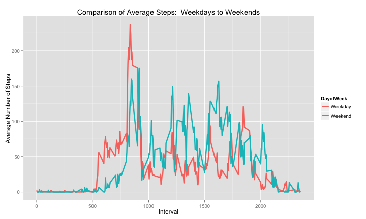

This document describes the data, processing steps, and analysis performed for the first assignment in the Reproducible Research Coursera course.

First, load the packages I will be using in the work that follows.


```r
library(reshape)
library(reshape2)
library(ggplot2)
library(plyr)
library(car)
library(lattice)
library(utils)
```

Now read the data and prepare the dataframe device.df for further processing

```r
temp <- tempfile()
download.file("https://d396qusza40orc.cloudfront.net/repdata%2Fdata%2Factivity.zip",temp, method = "curl")
device.df <- read.csv(unz(temp, "activity.csv"))
unlink(temp)

device.df$date <- as.Date(device.df$date)
device.df$DayofWeek <- weekdays(device.df$date)
device.df$DayofWeek <- factor(device.df$DayofWeek)
```

#### *__What is mean total number of steps taken per day?__*


Now, work with NA values removed


```r
## remove NA values
deviceNONA.df <- na.omit(device.df)

## and then sum total steps over each date.  
stepsTotbyDate <- tapply(deviceNONA.df$steps, deviceNONA.df$date, sum)
stepsTotbyDate[1:10]
```

```
## 2012-10-02 2012-10-03 2012-10-04 2012-10-05 2012-10-06 2012-10-07 
##        126      11352      12116      13294      15420      11015 
## 2012-10-09 2012-10-10 2012-10-11 2012-10-12 
##      12811       9900      10304      17382
```

Now construct plot using ggplot2


```r
stepsTotbyDate <- melt(stepsTotbyDate, id = "date")
g <- ggplot(stepsTotbyDate, aes(x=stepsTotbyDate$value)) +
            geom_histogram(binwidth=1000, colour="black", fill="orange")
g<- g + ggtitle ("Total Number of Steps per Day") + xlab("Steps") + ylab("Number of Days")
g <- g + theme(panel.grid.minor.x=element_blank(), 
               panel.grid.major.x=element_blank())
g
```

 

Now calculate mean and median of the total number of steps each day:


```r
stepsMean <- mean(stepsTotbyDate$value)
stepsMedian <- median(stepsTotbyDate$value)
```

* The mean is 10766.19 steps per day.  The median is 10765 steps per day. *

-----

#### *__What is the average daily activity pattern?__*

I will use the deviceNONA.df dataframe, which has NA values removed.  Values of "0" I am assuming are real values and will be included in the averages


```r
stepsAvgbyInterval <- tapply(deviceNONA.df$steps, deviceNONA.df$interval, mean)
stepsAvgbyInterval[1:10]
```

```
##         0         5        10        15        20        25        30 
## 1.7169811 0.3396226 0.1320755 0.1509434 0.0754717 2.0943396 0.5283019 
##        35        40        45 
## 0.8679245 0.0000000 1.4716981
```

```r
stepsAvgbyInterval <- melt(stepsAvgbyInterval, id="date")

## and now plot the time series
ggplot(stepsAvgbyInterval, aes(indices, value)) + geom_line() +
   xlab("Interval") + ylab("Average Number of Steps") + ggtitle("Steps by Interval, Averaged over All Days")
```

 


```r
## now get the interval corresponding to where the maximum avg number of steps occurs
maxInterval <- stepsAvgbyInterval[which.max(stepsAvgbyInterval$value),1]
```

* And the interval with the maximum number of average steps is: 835. *

-----

#### *__Inputing missing values__*

I will use the device.df dataframe which has the NA values kept in.
First, I'll count the number of rows where there is a missing value in device.df$steps

```r
missingData <- sum(is.na(device.df$steps))
```

There are 2304 missing values in the original dataset.

I want to first get a sense of where the NA values are in the original data


```r
missing.df <- device.df[is.na(device.df$steps),]  ## this is the subset of the data with NA values
missing.df[1:10,]
```

```
##    steps       date interval DayofWeek
## 1     NA 2012-10-01        0    Monday
## 2     NA 2012-10-01        5    Monday
## 3     NA 2012-10-01       10    Monday
## 4     NA 2012-10-01       15    Monday
## 5     NA 2012-10-01       20    Monday
## 6     NA 2012-10-01       25    Monday
## 7     NA 2012-10-01       30    Monday
## 8     NA 2012-10-01       35    Monday
## 9     NA 2012-10-01       40    Monday
## 10    NA 2012-10-01       45    Monday
```

```r
scatterplot(interval ~ date | DayofWeek, data = missing.df, main = "Scatterplot of missing data", xlab = "date", ylab = "interval")
```

 

It appears that the missing data are in two patterns: i) across many intervals on a small number of days, on different days of the week (vertical lines on graph) and ii) a small number of instances where the interval across many days are NAs (horizontal lines on graph)

So the strategy I will follow for filling in NA values will be to use the average number of steps in the same interval on the same day of the week as that of the missing data.  For example, if there is an "NA" corresponding to a Monday,interval 105, then i will replace it with the average of all Monday  interval 105 datapoints that do exist.  In the event that there are no existing datapoints for that day of week and interval, i will replace it with a 0.

First, calculate the average number of steps per interval per day of the week from deviceNONA which has NA values removed:


```r
avg <- aggregate (deviceNONA.df$steps, by = list(deviceNONA.df$DayofWeek,deviceNONA.df$interval), FUN = "mean")
colnames(avg) <- c("DayofWeek","interval","stepsAvg")
```

which results in the dataframe (only partially printed)

```r
avg[1:10,]
```

```
##    DayofWeek interval stepsAvg
## 1     Friday        0 0.000000
## 2     Monday        0 1.428571
## 3   Saturday        0 0.000000
## 4     Sunday        0 0.000000
## 5   Thursday        0 5.875000
## 6    Tuesday        0 0.000000
## 7  Wednesday        0 4.250000
## 8     Friday        5 0.000000
## 9     Monday        5 0.000000
## 10  Saturday        5 0.000000
```


Now, replace the "NA" values in missing.df with the corresponding average from the avg dataframe, then insert missing.df into the original dataset


```r
for ( i in 1:nrow(missing.df)) {
        k <- which(missing.df$interval[i] == avg$interval & missing.df$DayofWeek[i] == avg$DayofWeek)
        ifelse (length(k) == 0, missing.df$steps[i] <- 0, missing.df$steps[i] <- avg$stepsAvg[k])
}
device.df[is.na(device.df$steps),] <- missing.df
```


There are now 0 missing values in the original dataset.


The histogram for total number of steps taken each day is now:

 

The mean is 10821.21 steps per day.  The median is 11015 steps per day.


*  So by imputing values for the NA values in the original dataset, we have increased the mean and median steps per day.  And since the imputed values are averages over several days, in general we are increasing the mass of the distribution in the vicinity of the mean and median.  Of course, not all strategies would have yielded this result.  I could easily have taken the "max" rather than the "mean" as my subsitution criteria, which would have had the effect of shifting the histogram values slightly to the right (i speculate). *


----
#### *__Are there differences in activity patterns between weekdays and weekends?__*

I will use the device.df dataframe which already has the DayofWeek column included.  I will start by recoding the factor variables in the DayofWeek column to be either "Weekday" or "Weekend", then summarize over those factor variables


```r
device.df$DayofWeek <-  recode(device.df$DayofWeek,"c('Saturday','Sunday') = 'Weekend' ; else= 'Weekday'")
aggdata <- tapply(device.df$steps, device.df[,c(3,4)], FUN = mean)
aggdata[1:10,]
```

```
##         DayofWeek
## interval    Weekday   Weekend
##       0  2.31071429 0.0000000
##       5  0.45000000 0.0000000
##       10 0.17500000 0.0000000
##       15 0.20000000 0.0000000
##       20 0.08888889 0.0000000
##       25 1.56388889 3.7142857
##       30 0.62222222 0.0000000
##       35 1.15000000 0.0000000
##       40 0.00000000 0.0000000
##       45 1.80000000 0.4285714
```

Then I construct the plot of the two times series

```r
aggdata <-melt(aggdata)
plot = ggplot(data=aggdata,aes(x=interval,y=value)) + geom_line(aes(color=DayofWeek, ),size=1.15) +
    scale_x_continuous("Interval") + scale_y_continuous("Average Number of Steps")
plot = plot + ggtitle("Comparison of Average Steps:  Weekdays to Weekends")
plot
```

 

Alternatively, to achieve the desired format as instructed, using Lattice we get

```r
xyplot(value ~ interval | DayofWeek, data = aggdata, layout = c(1,2), type="l",main="Comparison of Steps:  Weekdays to Weekends", xlab = "Interval", ylab = "Number of Steps")
```

 

* So there are clearly differences in number of steps over the course of a weekday versus the weekend.  One that I can relate to is regarding the early part of the day and the difference when the steps start to increase : noticeably later on weekends than on weekdays. 
